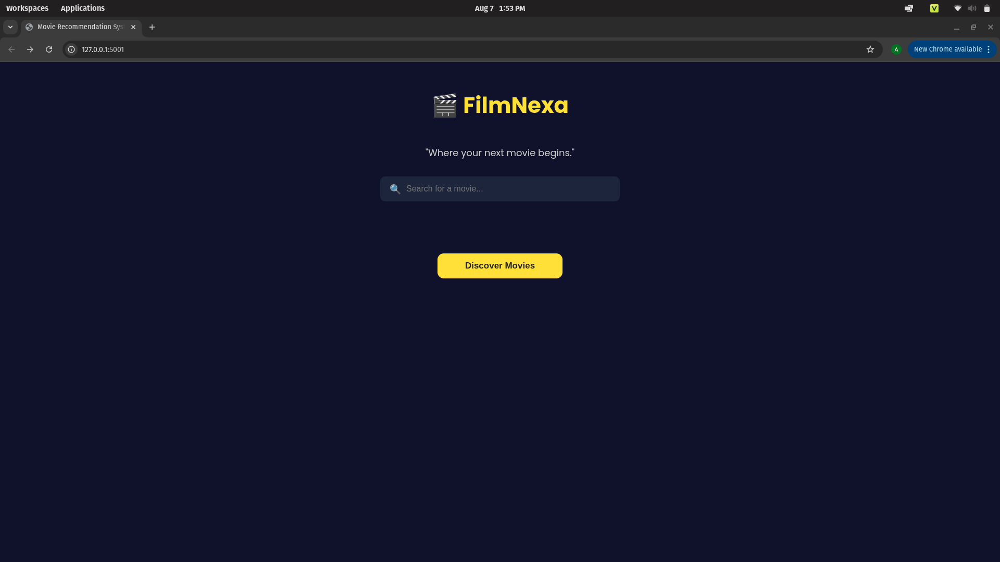
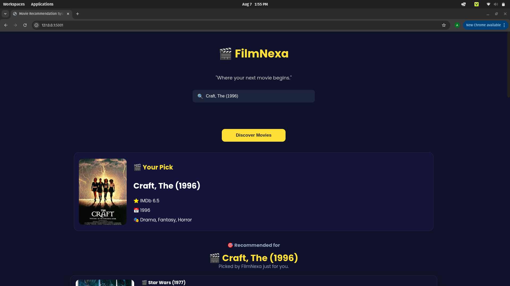
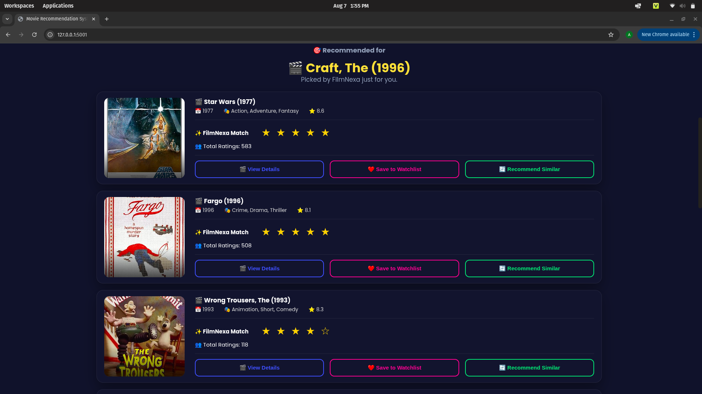

# FilmNexa — Hybrid Movie Recommender System

A personalized movie recommendation engine built on the MovieLens 100K dataset, combining collaborative filtering, swarm intelligence, and fuzzy logic into a multi-source hybrid pipeline. A self-directed learning project built to deepen my understanding of recommender systems.

*Built by Anjana Sankar KP, an MCA student at Cochin University of Science and Technology.*

## Overview

This project blends three complementary recommendation approaches and uses an optimization algorithm to decide how much to trust each one, per user:

1. Collaborative Filtering (ML Core) — Matrix Factorization (SVD) and KNN-based similarity filtering
2. Content-Based Filtering — TF-IDF similarity over movie metadata
3. Swarm Intelligence — Artificial Bee Colony (ABC) algorithm optimizes blend weights across all three sources
4. Soft Computing — Fuzzy User Profiling classifies users into behavioral clusters (Casual Watcher, Genre Enthusiast, Binge Watcher)
5. Mathematical Optimization — Custom Stochastic Gradient Descent optimizer with momentum, built from scratch to minimize RMSE

## Tech Stack

- Backend: Python, Flask
- ML / Data: Pandas, NumPy, Scikit-learn, Surprise
- Frontend: HTML, CSS, JavaScript
- External API: OMDb API (movie posters and metadata)

## Results

| Component | Result |
|---|---|
| Custom SGD + Momentum training RMSE | 0.38 (train), 1.03 (held-out test) |
| ABC-optimized blend weights | KNN: 0.335, SVD: 0.336, Content: 0.330 |
| Precision@10 (blended vs single-source) | Blended strategies avoided catastrophic per-query failures seen in single-source baselines |

## Getting Started

Prerequisites: Python 3.10+, a free OMDb API key (https://www.omdbapi.com/apikey.aspx), and the MovieLens 100K dataset (https://grouplens.org/datasets/movielens/100k/).

Setup steps:

1. Clone the repo: git clone https://github.com/anjanasankarkp/hybrid-movie-recommender.git
2. Create a virtual environment: python -m venv venv
3. Activate it: source venv/bin/activate
4. Install dependencies: pip install -r requirements.txt
5. Copy config_example.py to config.py and add your OMDb API key
6. Download the MovieLens 100K dataset and place it at data/ml-100k/u.data and data/ml-100k/u.item
7. Run the app: python app.py
8. Visit http://127.0.0.1:5001 in your browser

## Project Structure

- app.py — Flask application and routes
- hybrid_recommender.py — Combines KNN, SVD, and Content with ABC/fuzzy weights
- collaborative_knn.py — KNN-based collaborative filtering
- svd_model.py — SVD collaborative filtering (Surprise library)
- content_based.py — TF-IDF content-based filtering
- abc_optimizer.py — Artificial Bee Colony implementation
- train_abc_weights.py — Offline script to run ABC and save weights
- fuzzy_profile.py — Fuzzy user profiling
- sgd_momentum_svd.py — Custom SGD+Momentum matrix factorization
- evaluation.py — Precision@10 evaluation
- omdb.py — OMDb API integration
- static/ — CSS, JS, images
- templates/ — HTML templates

## License

This project is available under the MIT License.

## Note on Pretrained Files

Two generated files are intentionally excluded from this repo via .gitignore, since they are outputs of training rather than source code:

- abc_weights.json — the optimized blend weights produced by the ABC algorithm
- sgd_momentum_model.pkl — the trained custom SGD+Momentum model

To generate them yourself after cloning:

1. Run: python train_abc_weights.py  (creates abc_weights.json)
2. Run: python sgd_momentum_svd.py   (creates sgd_momentum_model.pkl)

The app will run without these files using fallback default weights, but recommendation quality and the custom SGD model will not be available until they are generated.
